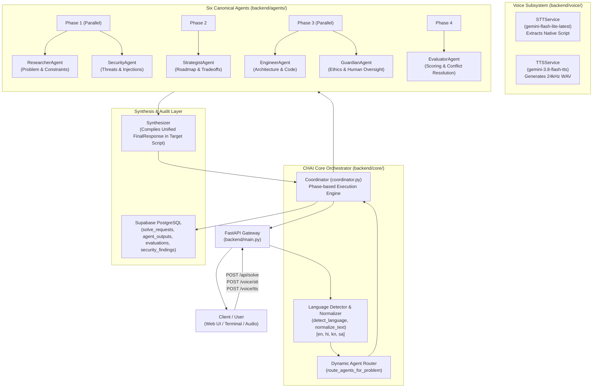
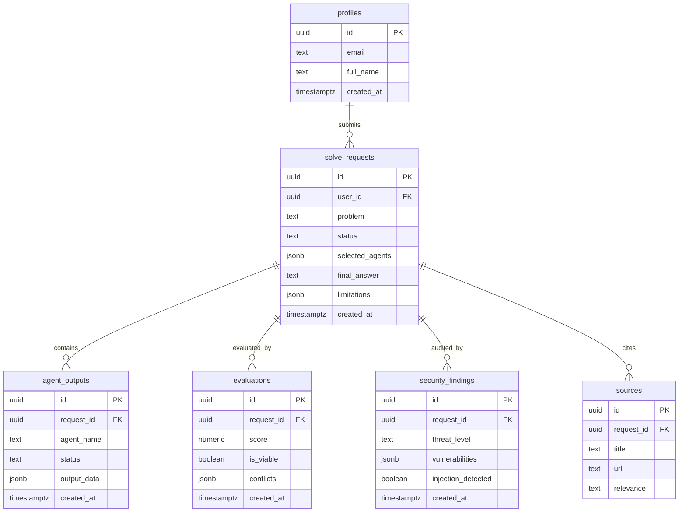

# CHAI Platform: Complete Architecture & System Workflow Guide for GPT

> **Coordinated Hybrid Agentic Intelligence (CHAI)**  
> *A production-grade, multi-agent AI problem-solving platform featuring governed 6-agent orchestration, native Indic multilingual NLP, multimodal voice (STT/TTS) interfaces, and Supabase audit persistence.*

---

## 1. Executive Summary & Core Mission

CHAI is an enterprise-grade AI problem-solving architecture built for complex, high-stakes domains (healthcare, engineering, policy, infrastructure). Unlike simple single-prompt LLM wrappers, CHAI decomposes problems across **six specialized, autonomous agents** that analyze, plan, implement, review safety, assess security, and evaluate consistency.

### Key Pillars
1. **Governed Multi-Agent Reasoning**: Coordinated execution across 6 canonical agents with deterministic failure isolation and synthesis.
2. **Native Indic Multilingualism**: First-class support for **English (`en`)**, **Hindi (`hi`)**, **Kannada (`kn`)**, and **Sanskrit (`sa`)** with strict Unicode script preservation (Kannada script is strictly preserved and never transliterated into Devanagari).
3. **Multimodal Voice Subsystem**: Cloud-backed Speech-to-Text (STT) and Text-to-Speech (TTS) using Google GenAI SDK with zero hallucinated translations.
4. **Resilient Persistence**: Supabase PostgreSQL database storing full audit trails across 6 dedicated tables with automatic offline mock fallbacks.

---

## 2. System Architecture & End-to-End Dataflow



---

## 3. The Six-Agent System

Every problem processed through CHAI passes through specialized agents. **Their names and roles are non-negotiable invariants**.

| Agent | Module Path | Primary Responsibility | Key Output Fields |
| :--- | :--- | :--- | :--- |
| **Researcher** | `backend.agents.researcher` | Decomposes problem, identifies user personas, requirements, edge cases, external assumptions. | `summary`, `key_findings`, `constraints`, `sources` |
| **Strategist** | `backend.agents.strategist` | Grounded in research; formulates phased action roadmap, operational priorities, and trade-offs. | `strategy`, `phases`, `priorities`, `risks` |
| **Engineer** | `backend.agents.engineer` | Designs technical architecture, components, schemas, APIs, and runnable code artifacts. | `architecture`, `components`, `code_snippets`, `api_design` |
| **Guardian** | `backend.agents.guardian` | Evaluates safety, ethics, societal bias, privacy violations, and human-in-the-loop oversight. | `is_safe`, `ethical_concerns`, `mitigations`, `oversight_required` |
| **Security** | `backend.agents.security` | Assesses cybersecurity attack surfaces, prompt injection risks, data exfiltration, and CVEs. | `threat_level`, `vulnerabilities`, `injection_detected`, `recommendations` |
| **Evaluator** | `backend.agents.evaluator` | Evaluates cross-agent alignment, requirement coverage, resolves conflicts, and gives quality score. | `score (0-100)`, `is_viable`, `detected_conflicts`, `verdict` |

### Critical Distinction: Guardian vs. Security
* **Guardian Agent**: Focuses on **ethical, safety, human, and legal governance** (e.g., medical misinformation, harmful advice, bias, user consent, regulatory compliance).
* **Security Agent**: Focuses on **technical information security & cybersecurity** (e.g., prompt injections, jailbreaks, SSRF, SQL injection, secrets leakage, insecure dependencies).

### Coordinator Execution Phases (`backend/core/coordinator.py`)
1. **Phase 1 (Discovery & Threat Check)**: `Researcher` and `Security` run concurrently via `asyncio.gather`. If prompt injection is detected, flags are recorded.
2. **Phase 2 (Strategy Formulation)**: `Strategist` executes, conditioned on the Researcher's findings.
3. **Phase 3 (Implementation & Safety Governance)**: `Engineer` and `Guardian` execute concurrently.
4. **Phase 4 (Cross-Agent Evaluation)**: `Evaluator` inspects all outputs, computes quality score (0–100), and records conflicts.
5. **Phase 5 (Synthesis & Localization)**: `Synthesizer` compiles all outputs into a coherent `FinalResponse` localized into the user's requested language.

### Failure Isolation Guarantees
* Individual agent exceptions or malformed outputs are caught and recorded as `AgentExecutionStatus(status="failed" | "degraded")`.
* A single agent failure **never** crashes the entire pipeline. Default fallback structures ensure synthesis completes gracefully.

---

## 4. Multilingual NLP Layer (`backend/core/language.py`)

CHAI supports 4 canonical languages:

| Code | Language | Script | Detection Criteria | Special Prompt Rules |
| :---: | :---: | :---: | :---: | :---: |
| `en` | English | Latin (`a-z`) | ASCII / Latin character prevalence | Default fallback |
| `hi` | Hindi | Devanagari (`\u0900-\u097F`) | Devanagari Unicode block + Hindi stopwords (`है`, `का`, `की`) | Native Devanagari |
| `kn` | Kannada | Kannada (`\u0C80-\u0CFF`) | Any character in `\u0C80-\u0CFF` | **Strict Kannada script! Never transliterate to Devanagari or Latin!** |
| `sa` | Sanskrit | Devanagari (`\u0900-\u097F`) | Devanagari Unicode block + Sanskrit markers (`म्`, `ः`, `अस्ति`, `इदम्`) | Classical Devanagari |

### Non-Negotiable Script Invariant
> [!IMPORTANT]
> **Devanagari text does not mean Hindi.**
> **Kannada has its own dedicated script (`ಕನ್ನಡ ಲಿಪಿ`).**
> When a user speaks or submits Kannada, the system **MUST NOT** transliterate it into Devanagari (e.g., `हे गीतिरा` is incorrect; `ಹೇಗಿದ್ದೀರಾ` is correct). It must **NEVER** translate Kannada speech to Hindi or English without explicit instruction.

---

## 5. Voice Subsystem (`backend/voice/`)

### Speech-to-Text (STT) — `backend/voice/stt_service.py`
* **Model**: Uses `gemini-flash-lite-latest` or `gemini-3.5-transcribe` via modern `google.genai` SDK.
* **Audio Containers Supported**: Automatically wraps raw PCM or parses WAV, WebM, MP3, and Ogg.
* **Structured Model Output**: Instructs Gemini to return:
  ```text
  LANGUAGE: <en|hi|kn|sa>
  TEXT: <transcription in authentic native script>
  ```
* **Script Safeguard (`parse_stt_result`)**: If Gemini provider metadata claims `"en"`, but the text contains Kannada Unicode characters (`\u0C80-\u0CFF`), the parser unconditionally forces language to `"kn"`.

### Text-to-Speech (TTS) — `backend/voice/tts_service.py`
* **Primary Model**: `gemini-3.8-flash-tts` (`models/gemini-3.8-flash-tts`).
* **Fallback Model**: `gemini-3.8-flash-lite-tts` (seamlessly used if 429 RPM limit is reached).
* **Interface**:
  ```python
  class TTSService:
      async def synthesize(self, text: str, language: str = "en") -> bytes:
          ...
  ```
* **Output**: Generates high-fidelity 24 kHz, 16-bit mono WAV audio bytes.

---

## 6. Database & Persistence Schema (`supabase/migrations/001_initial_schema.sql`)

CHAI uses Supabase PostgreSQL with 6 primary relational tables:



* **Resilience Rule**: If Supabase credentials are not present in `.env`, `backend/shared/supabase_client.py` gracefully disables persistence and CHAI functions entirely in memory without throwing errors.

---

## 7. Project Directory Layout

```text
CHAI-Platform/
├── .env                              # Environment secrets (GEMINI_API_KEY, SUPABASE_URL, etc.)
├── .env.example                      # Template for required environment variables
├── requirements.txt                  # Python dependencies (google-genai, fastapi, pydantic, sounddevice)
├── pytest.ini                        # Pytest configuration
├── docs/
│   ├── gpt_workflow_guide.md         # This comprehensive GPT / developer workflow guide
│   ├── architecture.md               # High-level architecture reference
│   └── agent_responsibilities.md     # Agent contracts and roles
├── backend/
│   ├── main.py                       # FastAPI application entrypoint (CORS, routers)
│   ├── config.py                     # Global Settings (Pydantic BaseSettings, extra="ignore")
│   ├── api/
│   │   ├── routes.py                 # POST /api/solve endpoint
│   │   ├── voice_routes.py           # POST /voice/stt & POST /voice/tts endpoints
│   │   └── health.py                 # GET /api/health endpoint
│   ├── core/
│   │   ├── coordinator.py            # Central 6-agent orchestrator & execution pipeline
│   │   ├── language.py               # Multilingual detection, normalization, script verification
│   │   ├── router.py                 # Problem routing logic to agents
│   │   └── schemas.py                # Pydantic schemas (SolveRequest, FinalResponse, etc.)
│   ├── agents/                       # The 6 canonical agents
│   │   ├── researcher/               # ResearcherAgent
│   │   ├── strategist/               # StrategistAgent
│   │   ├── engineer/                 # EngineerAgent
│   │   ├── guardian/                 # GuardianAgent (Ethics & Safety)
│   │   ├── security/                 # SecurityAgent (Cybersecurity & Injections)
│   │   └── evaluator/                # EvaluatorAgent (Scoring & Conflicts)
│   ├── synthesis/
│   │   └── synthesizer.py            # Multi-agent synthesis & localization engine
│   ├── voice/
│   │   ├── stt_service.py            # Speech-to-Text (Gemini multimodal transcription)
│   │   ├── tts_service.py            # Text-to-Speech (gemini-3.8-flash-tts synthesis)
│   │   ├── voice_config.py           # VoiceSettings (Pydantic, extra="ignore")
│   │   └── voice_models.py           # STTResponse, TTSRequest, TTSResponse models
│   ├── shared/
│   │   ├── llm_client.py             # Gemini API client wrapper
│   │   ├── supabase_client.py        # Supabase database client wrapper
│   │   └── logger.py                 # Structured logging utility
│   └── tests/                        # Comprehensive test suite (170+ tests)
│       ├── test_multilingual.py      # Language detection, STT/TTS, script tests
│       ├── test_multi_agent_integration.py # Coordinator pipeline & agent tests
│       ├── test_database.py          # Supabase client mock/integration tests
│       └── test_api.py               # HTTP route integration tests
├── scripts/
│   ├── test_stt.py                   # Terminal microphone capture & STT transcription test
│   ├── test_tts.py                   # Terminal TTS speech generation test (outputs WAV)
│   └── demo_multilingual.py          # Multilingual pipeline demonstration script
└── supabase/
    └── migrations/
        └── 001_initial_schema.sql    # Full 6-table PostgreSQL database migration
```

---

## 8. Runbook & Common Workflows

### 1. Running the Backend Server
```powershell
uvicorn backend.main:app --host 0.0.0.0 --port 8000 --reload
```

### 2. Testing Multilingual NLP & Voice
```powershell
# Run all 28 multilingual unit tests
python -m pytest backend/tests/test_multilingual.py -v
```

### 3. Testing Voice STT from Terminal (Live Mic)
```powershell
python scripts/test_stt.py
```
* Records 10 seconds from default microphone.
* Transcribes via Gemini.
* Outputs text in original script (`kn`, `hi`, `en`, `sa`).

### 4. Testing Voice TTS from Terminal (Generates Audio)
```powershell
python scripts/test_tts.py
```
* Synthesizes audio using `gemini-3.8-flash-tts`.
* Saves WAV file to `scripts/test_output.wav`.

### 5. Running the Complete Test Suite
```powershell
python -m pytest -q
```

---

## 9. Non-Negotiable Invariants for Any GPT / AI Developer

When modifying or extending CHAI, you **MUST ALWAYS** obey these rules:

1. **NEVER Rename or Remove the Six Agents**: Always keep `researcher`, `strategist`, `engineer`, `guardian`, `security`, `evaluator`.
2. **NEVER Conflate Guardian and Security**: Keep safety/ethics in Guardian and cybersecurity in Security.
3. **NEVER Conflate Kannada with Devanagari/Hindi**: Kannada script (`\u0C80-\u0CFF`) must be preserved as native Kannada Unicode. Never transliterate to Hindi.
4. **NEVER Expose or Hardcode Secrets**: Always use `.env` via `pydantic-settings` or `os.getenv()`. Never log API keys.
5. **ALWAYS Include `extra = "ignore"` in Pydantic Settings**: Any new environment variable (e.g., `GEMINI_MODEL`) in `.env` must never cause `ValidationError`.
6. **NEVER Run Destructive Git Commands**: Do not perform `git commit`, `push`, `rebase`, or branch switching without explicit user consent.
